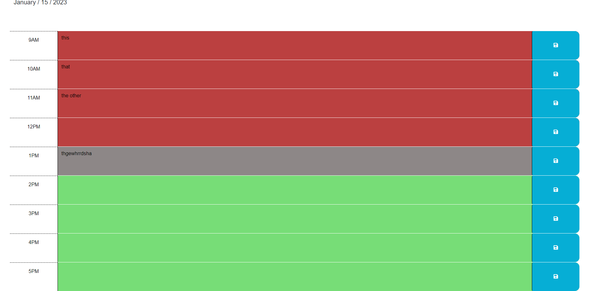

# Bootcamp-Work-Day-Planner
Work day planner that stores notes in localStorage and marks hour as past, present, or future

## Description

## Installation
N/A
## Usage
Go to the following URL:
https://airen22.github.io/Bootcamp-Challenge3/
The following image shows a screenshot of the website: 
## Credits
Karen Peazzoni: https://github.com/kpeazzoni/UTA-JS-Challenge-3
## License
Please refer to the LICENSE in the repo.

date present at top of page
 

hours change color depending on time
 

user input persists through page refresh
 

